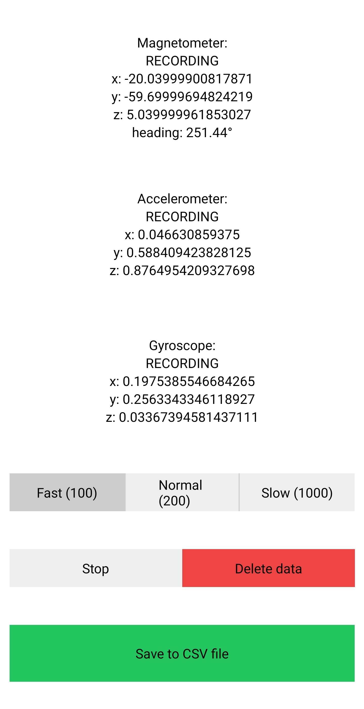

Android app made with [Expo](https://expo.dev/) to collect data from sensors and export it to CSV file

## Screenshot



## How to build .apk

run the following commands

```properties
npm install
npm run prebuild
npm run build:android
```
